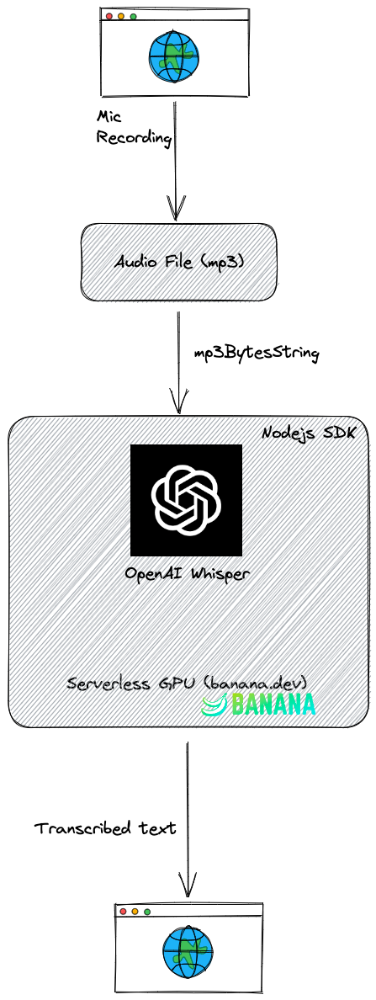

# Redhorse AI Transcriber

Demo link: https://redhorse-ai-transcriber.mharrvic.com

Repo link: [https://github.com/mharrvic/redhorse-ai-transcriber](https://github.com/mharrvic/redhorse-ai-transcriber)

## Overview

This is a demo app that shows how to use Openai's Whisper automatic speech recognition deployed to a Serverless GPU using Banana.dev

## Demo Video

https://user-images.githubusercontent.com/15852818/210168646-de7286d8-65b1-4514-9773-da995958a5b1.mp4

## Resources
- https://whisper-openai.vercel.app 100% inspired by this to help me understand the whole serverless gpu thing with banana.dev
- https://www.banana.dev/
- https://openai.com/blog/whisper/
